  

  

  
  
  
  

---

## 🚀 About Me

Full-stack developer building **photography SaaS platforms** ([Hafiportrait](https://github.com/ylxai/hafiportrait-saas)), **agentic AI infrastructure**, and **cryptocurrency** experiments. Currently deep in:

- 🖼️ Photography SaaS & automated proofing pipelines
- 🤖 Agentic AI systems & MCP-style tooling
- ⛓️ CPU-only Proof-of-Work (Cereblix CRB)
- 📱 iOS tweaks, Flutter apps & terminal tooling

## 🛠️ Tech Stack

  

## 📊 GitHub Stats

  
  
  

## 📌 Featured Projects

<table>
  <tr>
    <td align="center">
      
       🖼️ Photography SaaS Platform
    </td>
    <td align="center">
      
       ⛓️ CPU-only PoW Coin (NeuroMorph)
    </td>
  </tr>
  <tr>
    <td align="center">
      
       📱 iOS Terminal with AI
    </td>
    <td align="center">
      
       ☁️ Multi-Cloud Storage Gateway
    </td>
  </tr>
</table>

## 🏆 Achievements

  

## 🎮 Contribution Animation

  <picture>
    <source media="(prefers-color-scheme: dark)" srcset="ylxai-contribution-animation-dark.svg" />
    
  </picture>

---

  <b>Let's build something great together.</b> 
  <code>npm i -g ambition && npx passion --recursive</code> 🚀

