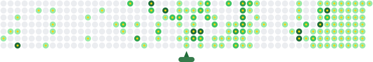

  

  

  
  
  

---

## 🚀 YLX — AI & SaaS Studio

I'm **Irvan Nandika**, Founder of **[YLX](https://ylex.my.id)** — a small startup studio building **AI-powered SaaS** for photographers and creators in Indonesia.

**Live product:** 🌐 **[ylex.my.id](https://ylex.my.id)** — Galeri Foto Pernikahan digital (Vol. I · 2026). Fotografer upload, klien buka galeri via nama/link.

**What we do:**
- 🖼️ **Photography SaaS** — gallery, proofing & automated pipelines ([ylx](https://github.com/ylxai/ylx) · [hafiportrait-saas](https://github.com/ylxai/hafiportrait-saas))
- 🤖 **Agentic AI infra** — MCP-style tooling & automation
- ☁️ **Multi-cloud storage** — one endpoint for all uploads ([storage-gateway](https://github.com/ylxai/storage-gateway))
- ⛓️ **R&D** — CPU-only PoW experiments ([cereblix](https://github.com/ylxai/cereblix))

> Startup mode: ship fast, measure, iterate. Monorepo aktif: [`ylxai/ylx`](https://github.com/ylxai/ylx) (Turborepo · apps + packages · docs: PRODUCT / ROADMAP / DESIGN).

## 🛠️ Tech Stack

  

## 📊 GitHub Stats

  
  
  

## 📌 Flagship — YLX Products

<table>
  <tr>
    <td align="center">
      
       🚀 <b>YLX Monorepo</b> — Live: <a href="https://ylex.my.id">ylex.my.id</a>
    </td>
    <td align="center">
      
       🖼️ Photography SaaS Platform
    </td>
  </tr>
  <tr>
    <td align="center">
      
       ☁️ Multi-Cloud Storage Gateway
    </td>
    <td align="center">
      
       ⛓️ CPU-only PoW Coin (NeuroMorph)
    </td>
  </tr>
</table>

> 📌 **Pin manual (penting untuk kesan startup):** buka [github.com/ylxai](https://github.com/ylxai) → Customize pins → pilih `ylx`, `hafiportrait-saas`, `storage-gateway`, `cereblix`.

## 🏆 Achievements

  

## 🎮 Contribution Animation

  <picture>
    <source media="(prefers-color-scheme: dark)" srcset="ylxai-contribution-animation-dark.svg" />
    
  </picture>

---

  <b>YLX — Let's build something photographers love.</b> 
  🌐 <a href="https://ylex.my.id">ylex.my.id</a> · 💼 Founder: Irvan Nandika · 📍 Indonesia 
  <code>npx ylx --ship --fast</code> 🚀

